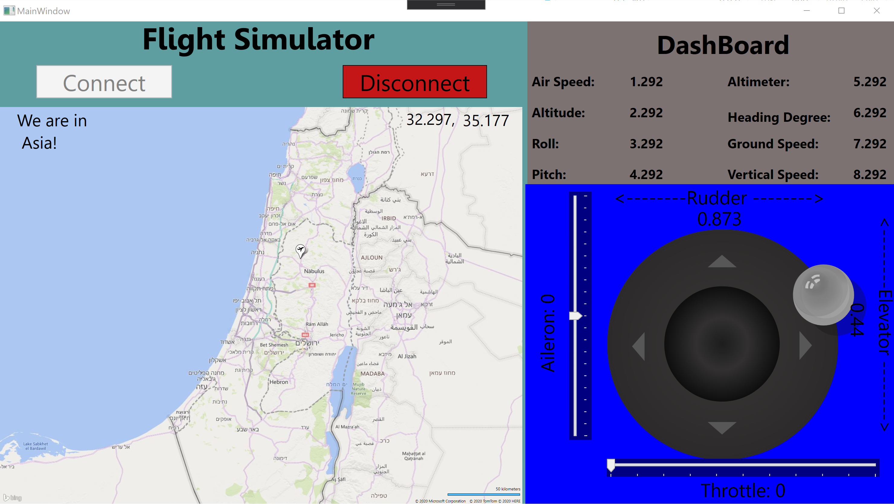

# FlightSimulatorApp
Advanced Programming 2 course, Flight Simulator App

Created by: Israel Shai and Gilad Asher

## Preview
A flight simulator desktop application that interacts with a dedicated server. We built our multithread application using C# and WPF with the MVVM software architectural pattern. The program features a convenient user interface for operating a small aircraft. The GUI contains four main components: A map components, a dashboard, a joystick and a connection section.

The user can connect to a server using the connect section, and controls the plane using the joystick. The plane moves on the map according to the data received from the server. The dashboard data is also displayed according to the data received from the server.



## Program explanation
### MVVM software architectural pattern
The program contains four main components: A map components, a dashboard, a joystick and a connection section.
Each component has it's view-model and view. The model implements an interface, that inherits from the ```INotifyPropertyChanged``` interface.

In the dashboard, connection and map components, the model updates the view-model when a property has changed, as the view-model updates the view - about changes that arrived from the server.

For example, the LatitudeError property in the dashboard's model:
```
//Property holding the plane's coordinates on the map
public string Coordinates
{
    set
    {
        this.CoordinatesF = value;
        NotifyPropertyChanged("Coordinates");
    }
    get
    {
        return this.CoordinatesF;
    }
}
```
In the View-Model we update the matching property and immediatly update the view:
```
this.SimulatorModel = simulatorModel;
SimulatorModel.PropertyChanged += delegate (Object sender, PropertyChangedEventArgs e)
{
    NotifyPropertyChanged("VM" + e.PropertyName);
};
...
//Property responsible for relaying the coordinates
public string VMCoordinates
{
    get
    {
        return SimulatorModel.Coordinates;
    }
}
```
The property is binded to the relavent field in the view.

In the Flight controls component, the view updates the view-model which then updates the view - about changes the user made to the joystick.

### Threads

The model opens a thread in order to read and write data to and from the server:
```
// We maintain a queue which collects the set commands, and send them to the server in the proper order
public void Start()
        {
            // Reading.

            new Thread(delegate ()
            {
                // for every get of variable:
                //check if we didn't send the Message, or if we didn't get respond, or if all worked
                List<Triplet<string, string, Status>> varsAndStatus = new List<Triplet<string, string, Status>>
                {
                    new Triplet<string, string, Status>("IndicatedHeadingDegF",
                    "get /instrumentation/heading-indicator/indicated-heading-deg\n", Status.NotSent),
                    new Triplet<string, string, Status>("GpsIndicatedVerticalSpeedF",
                    "get /instrumentation/gps/indicated-vertical-speed\n", Status.NotSent),
                    new Triplet<string, string, Status>("GpsIndicatedGroundSpeedKtF",
                    "get /instrumentation/gps/indicated-ground-speed-kt\n", Status.NotSent),
                    new Triplet<string, string, Status>("AirspeedIndicatorIndicatedSpeedKtF",
                    "get /instrumentation/airspeed-indicator/indicated-speed-kt\n", Status.NotSent),
                    new Triplet<string, string, Status>("GpsIndicatedAltitudeFtF",
                    "get /instrumentation/gps/indicated-altitude-ft\n", Status.NotSent),
                    new Triplet<string, string, Status>("AttitudeIndicatorInternalRollDegF",
                    "get /instrumentation/attitude-indicator/internal-roll-deg\n", Status.NotSent),
                    new Triplet<string, string, Status>("AttitudeIndicatorInternalPitchDegF",
                    "get /instrumentation/attitude-indicator/internal-pitch-deg\n", Status.NotSent),
                    new Triplet<string, string, Status>("AltimeterIndicatedAltitudeFtF",
                    "get /instrumentation/altimeter/indicated-altitude-ft\n", Status.NotSent),
                    new Triplet<string, string, Status>("LongitudeF","get /position/longitude-deg\n", Status.NotSent),
                    new Triplet<string, string, Status>("LatitudeF","get /position/latitude-deg\n", Status.NotSent)
                };

                while (!Stop)
                {
                    try
                    {
                        string accepted = "";
                        foreach (Triplet<string,string,Status> triplet in varsAndStatus)
                        {
                            if (triplet.Third == Status.NotSent)
                            {
                                WriteToServer(triplet.Second);
                                triplet.Third = Status.Sent;
                            }
                            if (triplet.Third == Status.Sent)
                            {
                                accepted = ReadFromServer();
                                triplet.Third = Status.SentAndRecieved;
                                HandleMessage(accepted, triplet.First);
                            }
                        }
                        foreach (Triplet<string, string, Status> triplet in varsAndStatus)
                        {
                            triplet.Third = Status.NotSent;
                        }

                        while (this.GetQueueVariables().Count > 0)
                        {
                            Message = this.GetQueueVariables().Dequeue();
                            WriteToServer(Message);
                            Message = ReadFromServer();
                            Message = "";
                        }
                        Thread.Sleep(250);
                    }
                    catch (IOException e)
                    {
                        if (e.Message.Contains("time"))
                        {
                            this.Error = "Server is too\n slow.";
                        }
                        else if (e.Message.Contains("forcibly closed"))
                        {
                            this.Error = "Server is down,\n disconnect please.";
                        }
                        else
                        {
                            if (this.Stream != null)
                            {
                                this.Error = "Read/Write Err.";
                            }
                        }
                        if (this.Stream != null)
                        {
                            this.Stream.Flush();
                        }
                    }
                }
            }).Start();
        }
```


## Server status
The application displays the connection buttons:


When user press connect it opens a window for connection details:


Trying to connect without server displays error on screen:


## Validating the data

The application validates the incoming data from the server, and shows if any received data from the server is incorrect.
For example when the server sends invalid type of data to the dashboard it displays:


